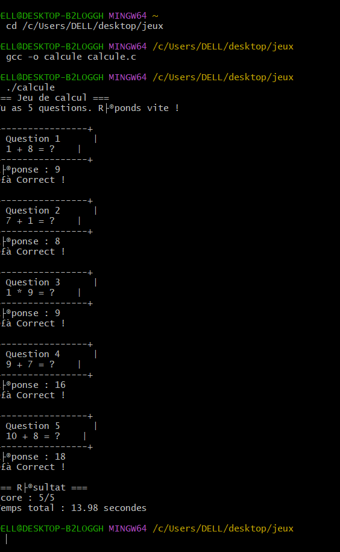

# Jeu de Calcul

## Description
Petit jeu où le joueur doit résoudre des opérations le plus rapidement possible.  
Les chiffres sont affichés dans des carrés et un timer mesure le temps.

## Fonctionnalités
- Génération d’opérations aléatoires
- Timer pour mesurer la rapidité
- Affichage du score final
- Interface simple et claire
## Installation et utilisation
1. clone this project 
2. Compile the game -'gcc -o calcule calcule.c'
3. Run the game -./calcule

## auteur
Jiane77

